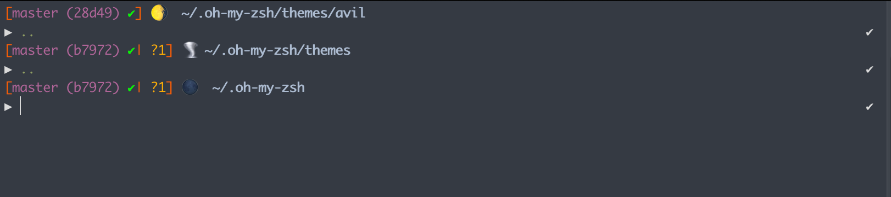

# AVIL - zsh theme

---

This is a zsh-theme that is convenient for a developer.



# Instalation

## If you're not a zsh user

- install zsh on you system
- make zsh as default sh
  - `chsh -s $(which zsh)`
- install **oh-my-zsh**
  - `sh -c "$(curl -fsSL https://raw.githubusercontent.com/robbyrussell/oh-my-zsh/master/tools/install.sh)"`
- You're a zsh user now.

## If you are a zsh user

Clone

```sh
git clone https://github.com/avil13/avil-zsh-theme.git ~/.oh-my-zsh/themes/avil --depth=1
```

Setup

```sh
# .zshrc
ZSH_THEME="avil/avil"
```

Enjoy =)


